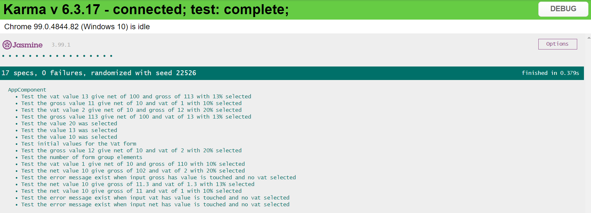

# Global Blue challenge

## Challenge 
As a web portal user, I would like to calculate Net, Gross, VAT amounts for purchases in Austria so that I can use correctly calculated data.

## Acceptance criteria

- If user inputs one of the net, gross or VAT amounts and additionally a valid Austrian
VAT rate (10%, 13%, 20%), the other two missing amounts (net/gross/VAT) are
calculated by the system and shown

- The system provides an error with meaningful error messages, in case of:
o missing or invalid (0 or non-numeric) amount input, more than one input
o missing or invalid (0 or non-numeric) VAT input

- Web interface must be responsive and needs to work on all standard desktop
resolutions – supported browsers are Mozilla, Chrome, Edge (no mobile or tablet
support)
## Solution

To solve this challenge I decided to use reactive forms. Thinking of it now the choice was not the best because with template driven forms would be much easier to do the challenge.

## Result

The final result looks like this:

The unit tests are the following:

